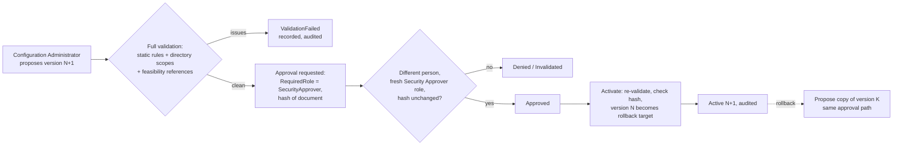

# Approvals and dual control

Every sensitive change needs a second person. An approval binds to the SHA-256 hash of exactly what the approver saw. It expires, and it becomes invalid if the content changes. **No approval can override the hardcoded Tier 0 floor.** No field, flag or approval path reaches it.

Code: `Ilm.Application/Approvals/ApprovalService.cs`, `ConfigurationService`, `LeaverWorkflowService`, `IdentityLinkService`, `IssuerMigrationService`, `FeasibilityService`.

## Approval model

| Field | Meaning |
|---|---|
| `SubjectType` / `SubjectId` | `LeaverRequest`, `ConfigurationVersion`, `IdentityLink`, `IssuerMigration`, `FeasibilityReport` or `ManualTaskVerification` |
| `ContentHash` | SHA-256 of the canonical plan or document |
| `RequiredRole` | The role the approver must hold, resolved freshly without the cache |
| `RequestedByUserId` | Can never approve. This includes the same person under a migrated issuer. |
| `ExpiresUtc` | Leavers 24 h (`LeaverApprovalValidityHours`), configuration 72 h |
| `ConfigurationVersion` | The configuration version active when the approval was requested |
| `Status` | `Pending`, `Approved`, `Rejected`, `Expired` or `Invalidated` |

The **Approvals** page lists them in those five states.

### Decision rules (`ApprovalService.DecisionBlocker`)

1. The approval must be `Pending` and not expired.
2. The approver isn't the requester, and isn't linked to the requester by an applied issuer migration.
3. The approver's roles were **freshly resolved** from Okta for this request.
4. The approver holds `RequiredRole`. A Security Approver also satisfies a Lifecycle Approver requirement.
5. The current content hash equals the approved hash. If the content changed, the approval becomes **Invalidated**.

Every decision, denial, expiry and invalidation is audited.

### Material changes invalidate approval

| Change after approval | Effect |
|---|---|
| The leaver plan hash changes before execution (for example a new account is linked, protection changes, or an authority rule changes) | Approval invalidated, request back to `AwaitingApproval` |
| The approval expires before execution | Invalidated, and re-approval requested |
| Configuration content edited after the proposal | Different hash, so the approval doesn't apply to it |
| An issuer migration's identities change | `ApplyAsync` refuses |

## What needs dual control

Anything that changes how ILM decides is part of the versioned **configuration document**, so it goes through one pipeline:

| Change (spec §15) | Where it lives | Approved by |
|---|---|---|
| Authority rules | `AuthorityRules` | Security Approver |
| Protection additions and attack-path imports | `ProtectionAdditions` | Security Approver |
| Connector modes | `Connectors[].Mode` | Security Approver |
| Containment policy (SafelyContained, Okta action, emergency override) | `LifecyclePolicies.SafelyContained` | Security Approver |
| Provisioning strategy activation | `FeatureFlags` plus authority rule strategy | Security Approver |
| Legacy write activation | Only `ContainmentOnlyLegacy` or `MigrationException` (with expiry). General write is rejected outright. | Security Approver |
| Okta provisioning activation | `FeatureFlags` plus `FeasibilityApprovals` | Security Approver, after a separately approved PCATEST report |
| Privileged account templates | `AccountTemplates` | Security Approver |
| Retention policy | `LifecyclePolicies.Retention` | Security Approver |
| Role mappings (immutable group IDs) | `RoleMappings` | Security Approver |

Other approvals:

| Subject | Required role |
|---|---|
| Leaver request | Lifecycle Approver. The plan needs a **Security Approver** if it includes legacy containment or any Tier 0 or Unknown object. |
| Leaver rollback (re-enable) | Security Approver |
| Identity link | Lifecycle Approver or Security Approver, but not the proposer. Name-only evidence can never be approved. |
| Issuer migration | Security Approver |
| Feasibility report | Security Approver. Mock runs can't be submitted. |

### The first version

No one holds a role until role mappings exist, so version 1 is created once, from a reviewed file in source control, with `bootstrap-config --file <json> --change <ticket>` on the host (see [DEPLOYMENT.md](DEPLOYMENT.md)).

- It gets the same full validation as any proposal.
- It's refused if any configuration already exists.
- The audit record carries the change ticket and the file's SHA-256.
- Dual control for this step is the change-management review of the file (two people). See [CHANGE-MANAGEMENT.md](CHANGE-MANAGEMENT.md).

## What the validator refuses, whoever approves

| Code | Refuses |
|---|---|
| `PROTECTION_SOURCE` | Declaring floor or platform identities in configuration, or any attempt to exclude them |
| `OVERLAPPING_WRITERS` | Two writers for the same population, action and attribute set |
| `CONTAINMENT_OWNER_MISSING` | An `AccountEnabledState` rule without a containment owner |
| `LEGACY_GENERALLY_WRITABLE` | `WriteTarget` or `ReadOnlyTarget` on a legacy forest |
| `UNRESTRICTED_SCOPE`, `SCOPE_NOT_GUID`, `SCOPE_UNRESOLVED` | Domain-wide scope, DNs or wildcards, and GUIDs that don't resolve to an OU |
| `PROTECTED_GROUP_ASSIGNMENT` | Templates assigning protected groups |
| `RUNTIME_IDENTITY_MANAGEABLE` | A scope containing the gMSA, host, database identity or break-glass accounts |
| `OKTA_PROVISIONING_WITHOUT_FEASIBILITY`, `FEASIBILITY_REFERENCE_INVALID` | Okta provisioning without an approved Go or Conditional Go PCATEST report |
| `FEATURE_UNKNOWN` | Any flag ILM doesn't define, including anything like "ManageTier0" |
| `SAFELY_CONTAINED_WEAKENED`, `SAFELY_CONTAINED_LINKS`, `OKTA_SESSIONS_OPTIONAL` | Making authentication or directory verification optional, letting unresolved links pass, or making Okta session revocation optional |
| `AUTOMATIC_DELETION` | Enabling automatic deletion |
| `ROLE_MAPPING_NOT_IMMUTABLE`, `ROLE_CACHE` | Role mappings by group name, and privileged role caching over 300 s |
| `MIGRATION_EXCEPTION_*` | Migration exceptions without a future expiry, lasting longer than the maximum, or including deletion. The approved link and transition state are checked when the exception is used. |
| `CONTAINMENT_MARKER_FORBIDDEN` | A containment marker attribute that isn't separately approved, or is a sensitive attribute |

`ConfigurationValidatorTests` (unit) and `ConfigurationWorkflowTests` (integration) cover these, including the full propose → approve → activate path.
