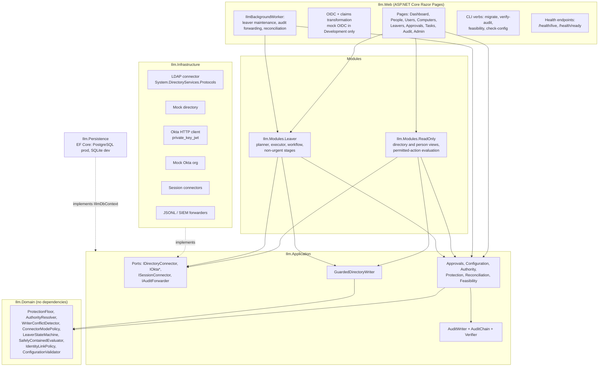

# Architecture

ILM Portal is a Tier 1 administrative web application. It runs leaver containment across an Okta tenant, a target AD forest and legacy AD forests, and gives read-only views of people, accounts, OUs and computers. The design baseline and its reasoning are in [`docs/architecture.md`](docs/architecture.md). This page describes the code as built.

## Application architecture

Dependencies point inwards. `Ilm.Domain` references nothing. `Ilm.Application` references only the domain. Infrastructure and persistence implement application ports. `ArchitectureRulesTests` enforces these rules, including a rule that only five named files may obtain a directory write channel. Every other file must go through `GuardedDirectoryWriter`.

## Projects

| Project | Responsibility |
|---|---|
| `Ilm.Domain` | Entities and pure policies: the person and identity model, 12 attribute sets, authority resolution and writer-conflict detection, connector modes, the Tier 0 protection floor, the leaver state machine, the SafelyContained policy and evaluator, and the configuration validator. |
| `Ilm.Application` | Ports, the six provisioning strategies, the audit chain, approvals, configuration versioning, protection evaluation with cross-forest FSP handling, authority service, reconciliation, the Okta-to-AD feasibility harness and report generator. |
| `Ilm.Infrastructure` | The LDAP connector, the in-memory mock directory, the Okta HTTP client and mock org, session connectors, the Okta role resolver, audit key provider and forwarders, and the fictional development data. |
| `Ilm.Persistence` | EF Core context with SQLite and PostgreSQL subclasses and separate migrations, append-only triggers, the connection security validator and the distributed lock. |
| `Ilm.Web` | Razor Pages UI, OIDC, authorisation policies, security headers, health checks, OpenTelemetry, background workers and CLI verbs. |
| `Ilm.Modules.ReadOnly` | OU browsing, user, computer and person views, and the "why is this action unavailable" evaluation. |
| `Ilm.Modules.Leaver` | Leaver request, plan, approval binding, containment execution and verification, manual fallback, non-urgent stages and maintenance. |

## Request path for a state-changing action

1. The browser posts a form with an antiforgery token. The `[RequirePermission]` attribute checks the permission against roles resolved on the server.
2. The page calls a module service with an `ActorContext` (issuer, subject, app user ID, roles, and whether the roles were freshly resolved).
3. The service evaluates scope (the OU GUID resolved to a DN at request time), protection and authority, then records the decision on the entity.
4. Directory writes go through `GuardedDirectoryWriter`. It re-checks connector mode, protection and the compare-and-swap precondition on the selected writable DC.
5. `SaveChangesAsync` seals the new audit records into the hash chain in the same transaction as the state change.
6. The background worker forwards the sealed records to the off-box sink.

## Enabled and disabled capabilities

| Capability | State | Where |
|---|---|---|
| Okta OIDC sign-in (mock OIDC in Development) | Enabled | `Ilm.Web/Authentication` |
| Role and scope authorisation | Enabled | `Permissions`, `ScopeEvaluator` |
| OU browsing, user, computer and person views | Enabled | `Ilm.Modules.ReadOnly` |
| Identity linking | Enabled | `IdentityLinkService` |
| Source-of-authority decisions | Enabled | `AuthorityService` |
| Protected-object detection | Enabled | `ProtectionService` |
| Leaver containment, approvals, durable states | Enabled | `Ilm.Modules.Leaver` |
| Reconciliation | Enabled | `ReconciliationService` |
| Tamper-evident audit | Enabled | `Ilm.Application/Audit` |
| Health and safe configuration management | Enabled | `HealthChecks`, `ConfigurationService` |
| Standard or administrative user creation | Disabled (`StandardUserCreation`, `AdministrativeUserCreation`) | `DirectActiveDirectoryStrategy` (14-step saga, behind flags) |
| Password reset, user move, computer disable and move | Disabled | Typed operations in `ConnectorModePolicy`. No UI path. |
| Okta user provisioning, Okta-to-AD provisioning | Disabled. Need an approved feasibility report. | `OktaApiProvisioningStrategy` |
| Entra, Exchange, Citrix, Mimecast lifecycle | Disabled | Typed interfaces. Manual tasks are generated instead. |

There is no feature flag for Tier 0 management, and the configuration validator rejects unknown flag names.

## Related documents

[SECURITY.md](SECURITY.md), [THREAT-MODEL.md](THREAT-MODEL.md), [IDENTITY-AUTHORITY.md](IDENTITY-AUTHORITY.md), [IDENTITY-LINKING.md](IDENTITY-LINKING.md), [PROTECTED-OBJECTS.md](PROTECTED-OBJECTS.md), [LEAVER-WORKFLOW.md](LEAVER-WORKFLOW.md), [DEPLOYMENT.md](DEPLOYMENT.md).
