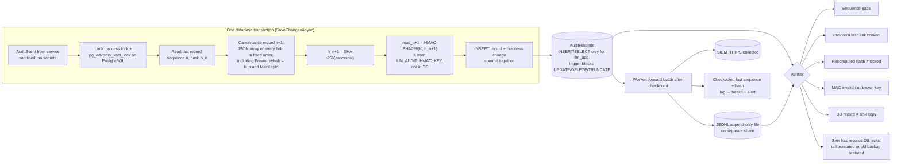

# Audit

Every state change in ILM writes an audit record in the same database transaction as the change. Records are **append-only**, **hash-chained**, **MAC'd with a key held outside the database**, and **forwarded to an off-box sink**. Secrets and passwords are never recorded.

Code:

- `Ilm.Application/Audit`: `AuditWriter`, `AuditSanitizer`, `AuditChain`, `AuditChainVerifier`, `AuditForwarding`, `CsvExporter`
- `Ilm.Persistence/IlmDbContext.SaveChangesAsync` (sealing)
- `Ilm.Infrastructure/Audit` (key provider, JSONL and SIEM forwarders)

## Audit chain

### What each attack looks like to the verifier

| Change | Detected as |
|---|---|
| A DBA edits a field of a record | Recomputed hash ≠ stored hash |
| A DBA edits the field *and* recomputes the hash | MAC invalid, because the DBA doesn't have `K` |
| The attacker also has `K` (host compromise) | Divergence from the off-box sink copy (R5) |
| Rows deleted from the middle | Sequence gap and broken `PreviousHash` link |
| Rows deleted from the end, or an old backup restored | The sink holds sequences the database lacks (R6) |
| The whole table replaced | Every record disagrees with the sink |

`AuditChainTests` (unit) and `DatabaseSecurityTests` (integration) show each case detected. On PostgreSQL, `PostgresPrivilegeTests` shows that `ilm_app` can't UPDATE or DELETE audit rows and that the trigger refuses even the owner's UPDATE.

## Fields

Each record has:

- **Sequence and integrity:** timestamp (UTC), event ID, sequence, previous hash, hash, MAC, MAC key ID
- **Correlation:** operation ID, correlation ID, idempotency key
- **Actor:** issuer and subject, application user ID, effective roles
- **What and where:** action, target stable ID, domain, forest, OU GUID
- **Decisions:** authority decision, protection decision, scope decision, approval, configuration version
- **Values:** safe before values, safe requested values, safe applied values
- **Execution:** selected connector, selected DC, attempted actions, verified actions, workflow state, result, duration, exception category, reconciliation results

## What is never recorded

`AuditSanitizer` runs on every value before it's stored. It redacts:

- properties whose names contain `password`, `secret`, `token`, `credential`, `apikey`, `privatekey`, `authorization`, `cookie`, `unicodePwd`, `laps`, `managedPassword`, `code_verifier` and similar
- `Bearer …`, `SSWS …`, JWTs and PEM private keys inside free text
- `password=…` style assignments

Tests plant a known value in a leaver reason, then check it appears nowhere in the audit table or the database file.

## Keys

| Environment | Key source |
|---|---|
| Production | `ILM_AUDIT_HMAC_KEY` (base64, at least 32 bytes), injected from the vault. The key ID is `Ilm:Audit:KeyId`. |
| Development | A random 32-byte key created in `App_Data/audit-dev.key` on first run (git-ignored) |

**Rotation.** Add the new key under a new key ID and keep the old key available for verification. The verifier looks up each record's `MacKeyId`. Never delete a retired key while records signed with it are retained.

## Off-box forwarding

`IlmBackgroundWorker` calls `AuditForwardingService` every 15 s. It forwards records after each sink's checkpoint in batches of 500, and advances the checkpoint only after the sink accepts the batch.

| Sink | Configuration | Notes |
|---|---|---|
| JSONL file | `Ilm:Audit:JsonlSinkPath` | Point it at a share the DBA can't write, with append-only permissions for the gMSA (see [DEPLOYMENT.md](DEPLOYMENT.md)). It's readable back, so the verifier can compare. |
| SIEM (HTTPS) | `Ilm:Audit:SiemEndpoint`, token from `ILM_SIEM_TOKEN` | Configure the SIEM index as immutable, with a retention at least as long as the database's. |

Lag beyond `MaxForwardingLag` (default 1000) makes `/health/ready` Degraded and raises a High `AuditForwardingLag` alert.

## Viewing, verifying and exporting

| Page or command | Who | What |
|---|---|---|
| Audit (`/Audit`) | Auditor, Security Approver | Search by action, operator subject, target, operation ID and time range. Filtering on an operation ID shows the timeline of that one operation. |
| Audit → Verify | Auditor | Runs the verifier against the database and the JSONL sink |
| Audit → Export | Auditor | CSV. Every cell starting with `=`, `+`, `-`, `@`, tab, CR or LF gets a leading apostrophe, and values are sanitised again. The export is itself audited. |
| `dotnet Ilm.Web.dll verify-audit` | Operator on the host | The same verification from the CLI. It exits with 3 if the chain is broken. |

## Retention

Audit records aren't deleted by ILM. Retention and archival are set out in [DATABASE-SECURITY.md](DATABASE-SECURITY.md). Archive by exporting a verified range, together with the key IDs, before any partition is dropped, and only under change control.
