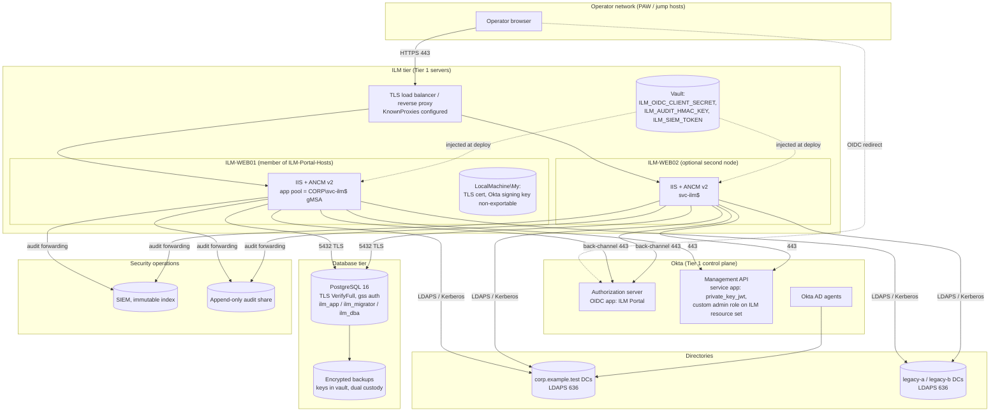

# Deployment

**Production:** Windows Server 2022 or later, IIS with the ASP.NET Core Module v2 (in-process), and the app pool running as a gMSA. PostgreSQL 16 or later with TLS and Kerberos. Okta OIDC for operators, and an Okta service app with `private_key_jwt`. The SIEM or an append-only share receives the audit trail.

**Development:** any OS with the .NET 10 SDK. SQLite is the default. PostgreSQL through Docker Compose is optional. It uses the mock OIDC provider, the mock Okta org and the mock directory, all with fictional `example.test` data.

> The Windows, IIS, gMSA, LDAP and live Okta parts of this page are **unverified** in this repository: none of those were available. The PowerShell scripts were written for this deployment but have not been run. Validate them in the Phase 3 lab ([ACTIVE-DIRECTORY.md](ACTIVE-DIRECTORY.md)).

## Production deployment



Two web nodes can serve requests at the same time:

- the audit chain is serialised by a PostgreSQL advisory lock
- leaver execution is serialised by the database lease lock
- one active leaver per person is enforced by a unique index

Run the **background workers on one node only**, with `Ilm:Workers:Enabled=false` on the others. Two audit forwarders racing on the same checkpoint could write duplicate entries to the sink.

## Steps

### 1. Prerequisites

| Item | Where |
|---|---|
| gMSA `svc-ilm`, host group, KDS root key | [ACTIVE-DIRECTORY.md](ACTIVE-DIRECTORY.md#gmsa), `deploy/windows/New-IlmGmsa.ps1` |
| OU delegation | `deploy/windows/Grant-IlmDelegation.ps1` |
| PostgreSQL, roles, TLS, `pg_hba` | [DATABASE-SECURITY.md](DATABASE-SECURITY.md), `deploy/postgres/*` |
| Okta OIDC app and service app | [OKTA-OIDC.md](OKTA-OIDC.md), [OKTA-AD-PROVISIONING.md](OKTA-AD-PROVISIONING.md) |
| TLS certificate for `ilm.corp.example.test` | Internal CA, in `LocalMachine\My` |
| .NET 10 ASP.NET Core Hosting Bundle | On each host |

### 2. Build and publish

On the build agent:

```bash
dotnet test Ilm.slnx -c Release
dotnet publish src/Ilm.Web -c Release -o out/ilm-web
```

Sign or hash the output, and record the SHA-256 in the change ticket.

### 3. Install

On each host, as a local administrator:

```powershell
.\deploy\windows\Install-IlmPortal.ps1 -SitePath D:\ILM\web -Gmsa 'CORP\svc-ilm$' -HostName ilm.corp.example.test -CertificateThumbprint <thumbprint> -WhatIf
.\deploy\windows\Install-IlmPortal.ps1 -SitePath D:\ILM\web -Gmsa 'CORP\svc-ilm$' -HostName ilm.corp.example.test -CertificateThumbprint <thumbprint>
Copy-Item out\ilm-web\* D:\ILM\web -Recurse
Copy-Item deploy\windows\web.config D:\ILM\web\web.config
```

- Create `D:\ILM\web\appsettings.Production.json` from `deploy/windows/appsettings.Production.example.json`. Replace every `<…>` value and every `example.test` value.
- Inject the secrets from the vault as app pool environment variables. They never go in files:
  - `ILM_OIDC_CLIENT_SECRET`
  - `ILM_AUDIT_HMAC_KEY` (base64, 32 bytes or more)
  - `ILM_SIEM_TOKEN`

### 4. Database

With the migration identity, in the change window:

```powershell
$env:ConnectionStrings__IlmMigration = 'Host=pgsql01.corp.example.test;Database=ilm;Username=ilm_migrator;SSL Mode=VerifyFull'
dotnet D:\ILM\web\Ilm.Web.dll migrate
psql "host=pgsql01.corp.example.test dbname=ilm user=ilm_migrator sslmode=verify-full" -f deploy\postgres\20-grants-after-migration.sql
```

### 5. First configuration version

Write the configuration document in source control:

- real connectors, OU scope GUIDs and immutable Okta group IDs
- the authority rules
- **no** Okta provisioning flags

Review it in a pull request (two people), then:

```powershell
dotnet D:\ILM\web\Ilm.Web.dll check-config --file ilm-config.json
dotnet D:\ILM\web\Ilm.Web.dll bootstrap-config --file ilm-config.json --change CHG-12345
```

`bootstrap-config` runs the full validation, including resolving every OU scope GUID against the directories. It works only while no configuration exists. Every later change goes through propose → Security Approver → activate in the portal ([APPROVALS.md](APPROVALS.md)).

### 6. Start and verify

- `https://ilm.corp.example.test/health/live` returns 200.
- `/health/ready` shows `database: Healthy`. `connectors` lists any not-integrated session systems as degraded. That's expected: containment for those systems becomes a manual task.
- Sign in as each role and check the **Me** page shows the expected roles and their source.
- `dotnet Ilm.Web.dll verify-audit` reports that the chain is valid.

### Startup refusals

ILM refuses to start in production if:

- the mock OIDC provider, mock Okta or development session mocks are configured
- the database is SQLite
- the database connection isn't TLS `VerifyFull`
- the database user is `postgres` or `ilm_migrator`
- a connection string contains a password
- any configuration key named like a secret holds a value
- the issuer or public URL isn't HTTPS
- the redirect URI isn't in the exact allowlist
- fictional seeding is enabled

## Development

```bash
# prerequisites: .NET 10 SDK; optional: Docker (Compose v2), Python 3 for the smoke test
dotnet tool restore
dotnet build Ilm.slnx
cd src/Ilm.Web && ASPNETCORE_ENVIRONMENT=Development dotnet run   # https://localhost:5001
```

- The first start applies the SQLite migrations to `src/Ilm.Web/App_Data/ilm-dev.db`, seeds the fictional people and bootstraps the fictional configuration.
- Sign in through the mock OIDC user picker. The operators are listed in [README.md](README.md).
- Trust the development certificate with `dotnet dev-certs https --trust`, if your OS supports it.
- To use PostgreSQL instead:
  - run `scripts/dev-env.sh && docker compose up -d postgres`
  - or run `scripts/run-smoke-postgres.sh`, which migrates as `ilm_migrator`, applies the grants, runs the app as `ilm_app` and smoke-tests it
- Optional telemetry: `docker compose --profile telemetry up -d otel-collector`, then set `OTEL_EXPORTER_OTLP_ENDPOINT=http://localhost:4317`.

## Configuration reference (appsettings)

| Key | Meaning |
|---|---|
| `ConnectionStrings:Ilm` / `IlmMigration` | Application and migration connections (no passwords in production) |
| `Ilm:Database:Provider` | `PostgreSql` (production) or `Sqlite` (development) |
| `Ilm:Authentication:*` | `Mode` (`Okta` or `MockOidc`), `Issuer`, `ClientId`, `ClientSecretEnvironmentVariable`, `PublicBaseUrl`, `AllowedRedirectUris`, `SessionMinutes` |
| `Ilm:Okta:*` | `Mode` (`Live` or `Mock`), `OrgUrl`, `ServiceClientId`, `SigningCertificateThumbprint`, `SigningKeyId`, `Scopes`, `TimeoutSeconds` |
| `Ilm:Audit:*` | `KeyEnvironmentVariable`, `KeyId`, `JsonlSinkPath`, `SiemEndpoint`, `SiemTokenEnvironmentVariable`, `MaxForwardingLag` |
| `Ilm:Platform:*` | Runtime identity, host, database, break-glass and password-retriever SIDs, host DNS names, `ManagedPasswordRetrieversVerified` |
| `Ilm:Sessions:UseDevelopmentMocks` | Development only |
| `Ilm:Workers:*` | `Enabled`, `LeaverIntervalSeconds`, `AuditForwardingIntervalSeconds`, `ReconciliationIntervalMinutes` |
| `Ilm:KnownProxies` | Reverse proxies trusted for forwarded headers |
| `OTEL_EXPORTER_OTLP_ENDPOINT` (env) | Turns on the OTLP export of traces and metrics |

Connectors, scopes, authority rules, protection additions, role mappings, lifecycle policies and feature flags are **not** appsettings. They're the versioned, approved configuration document in the database.
