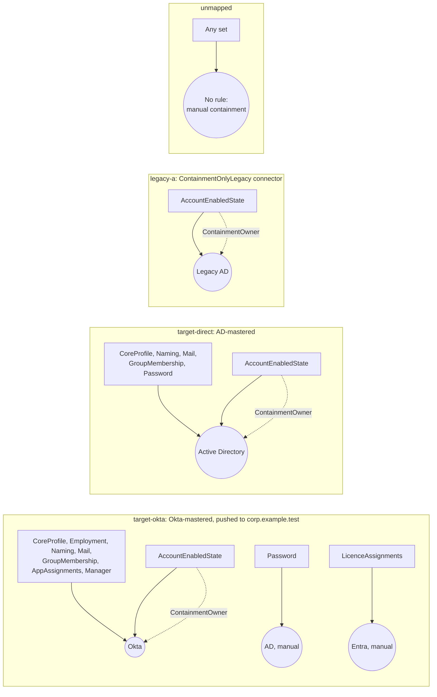
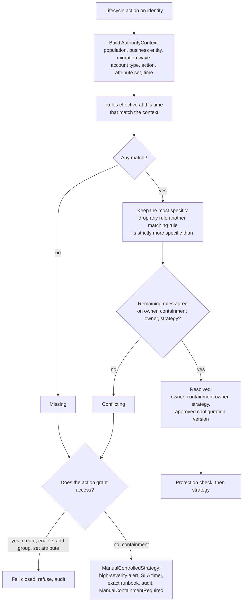

# Identity authority

"Who owns this user?" isn't one question. ILM asks, for each lifecycle action, which system owns each of the 12 attribute sets it touches. The answer comes from approved `AuthorityRule` records in the active configuration version.

Code: `Ilm.Domain/Authority`, `Ilm.Application/Authority/AuthorityService.cs`, `Ilm.Domain/Configuration/ConfigurationValidator.cs`.

## Attribute sets

| Set | Examples |
|---|---|
| `CoreProfile` | givenName, sn, displayName |
| `EmploymentAttributes` | department, title, company, employeeID |
| `NamingAttributes` | sAMAccountName, userPrincipalName, cn |
| `MailAttributes` | mail, proxyAddresses |
| `GroupMembership` | memberOf |
| `ApplicationAssignments` | Okta app assignments |
| `AccountEnabledState` | userAccountControl ACCOUNTDISABLE bit, Okta lifecycle status |
| `Password` | password set and reset (ILM never reads passwords) |
| `AuthenticationSessions` | Okta sessions, Entra tokens, Citrix and VPN sessions |
| `LicenceAssignments` | Microsoft 365 licences |
| `ManagerAndOwnership` | manager, managedBy, data and app ownership |
| `DeviceAccess` | device enrolment and access |

## Attribute ownership

`AccountEnabledState` must name a `ContainmentOwner`. If a rule leaves it out, the validator raises `CONTAINMENT_OWNER_MISSING`. The containment owner is the system ILM acts through to disable access:

| Population | Owner | ILM's action |
|---|---|---|
| Okta-mastered (`target-okta`) | Okta | Calls the Okta API to deactivate (or suspend, by policy) and revoke sessions, then reads AD to verify that the push disabled the account. ILM doesn't write `userAccountControl` for these users unless `EmergencyDirectoryOverride` is enabled and a Security Approver approved that specific leaver. |
| Direct AD (`target-direct`) | Active Directory | Would disable directly through `DirectActiveDirectoryContainment`. This flag is **off** initially, so the plan produces a manual task. |
| Legacy AD (`legacy-a`) | Active Directory (legacy), through the containment-only exception | Sets only the disable bit through `ContainmentOnlyLegacyStrategy`, then verifies |
| Legacy read-only (`legacy-b`) | Active Directory (legacy) | The connector is `ReadOnlyLegacy`, so containment is a manual task |

## Source-of-authority resolution

- **Specificity.** One rule is strictly more specific than another if it constrains a superset of the other's fields (business entity, migration wave, account type) and matches on all of them. Two matching rules where neither is more specific (for example one with a business entity and one with a wave) are **incomparable**. If they disagree, the result is `Conflicting`, never a silent pick.
- **Recording.** Every decision is recorded on the containment action and in the audit record's `AuthorityDecision` field, with the rule IDs and configuration version.

## One writer per set

`WriterConflictDetector` rejects a configuration where two rules could both apply to the same population, action and attribute set with different writers during overlapping effective periods (`OVERLAPPING_WRITERS`). It doesn't treat a `ContainmentOwner` as a second writer, because the rule explicitly assigns containment to that system.

## Migration state

`MigrationState` records, per person, the wave, the legacy and target identities, and which system owns authentication, provisioning and `AccountEnabledState` for that person right now. During coexistence (for example Bailey Sample in the development data: legacy-a plus target), the planner contains **both** accounts. A `MigrationException` connector mode allows only named operations, needs an approved link and an approved transition state, and must carry an expiry date (`MIGRATION_EXCEPTION_*` validator codes).

## Changing rules

Authority rules are part of the configuration document. A change goes through propose, validate, Security Approver approval (from a different person), activate and version, with a rollback version kept. See [APPROVALS.md](APPROVALS.md) and [CHANGE-MANAGEMENT.md](CHANGE-MANAGEMENT.md).
