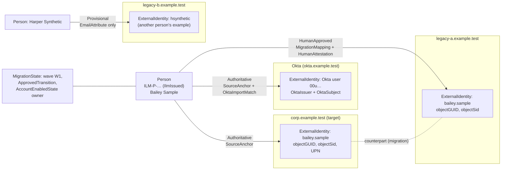

# Identity linking

A **person** isn't an **account**. ILM keeps one `Person` per human, and one `ExternalIdentity` per account in each directory or tenant. `IdentityLink` records join them, and each link carries its evidence and confidence. Leaver containment acts on every account whose link is confirmed. It can't mark someone SafelyContained while a link is still in doubt.

Code: `Ilm.Domain/Identity`, `Ilm.Application/Identity/IdentityLinkService.cs`, `Ilm.Modules.Leaver/ContainmentPlanner.cs`.

## Person and identity graph

## Entities

| Entity | Key fields |
|---|---|
| `Person` | `Id`, `PersonIdentifier` (`ILM-P-…`), `PersonIdentifierSource` (`IlmIssued`, `HrSystem` or `ManualAssertion`), optional `EmployeeIdentifier`, `DisplayName`, `LifecycleStatus`, `BusinessEntity`, `Department`, `ManagerPersonId`, `StartDate`, `EndDate` |
| `ExternalIdentity` | `System`, `ForestOrTenantId`, `StableObjectId`, `ObjectGuid`, `ObjectSid`, `DistinguishedName` (informational only), `SamAccountName`, `UserPrincipalName`, `Mail`, `OktaIssuer`, `OktaSubject`, `EntraObjectId`, `SourceAnchor`, `State`, `LastReconciledUtc`, plus `Population`, `AccountType` and `ConnectorId` |
| `IdentityLink` | `PersonId`, `SourceIdentityId`, `TargetIdentityId`, `LinkMethod`, `EvidenceType` (flags), `EvidenceReference`, `Confidence`, `ApprovedBy`, `ApprovedUtc`, `EffectiveFrom`, `EffectiveUntil` |
| `MigrationState` | Wave, legacy and target identity, which system owns authentication, provisioning and `AccountEnabledState`, Okta and cloud identities, state, cutover date, rollback deadline |

ILM doesn't invent an HR identifier. No HR source exists yet ([ASSUMPTIONS.md](ASSUMPTIONS.md) A6), so ILM issues its own `PersonIdentifier`, and `EmployeeIdentifier` evidence is treated as no stronger than email.

## Confidence rules

| Confidence | How it arises | Contained automatically? |
|---|---|---|
| `Authoritative` | System evidence: `SourceAnchor` or `MigrationMapping`, with exactly one candidate | Yes |
| `HumanApproved` | A second person approved it, with non-name evidence | Yes |
| `Provisional` | Automatic match on email, employee record or Okta import only | No. It blocks SafelyContained until confirmed or rejected. |
| `Ambiguous` | Several candidates, name-only evidence, or no evidence | No. It blocks SafelyContained. |
| `Rejected` | A human decided the account belongs to someone else | No, and it no longer blocks |

These rules are enforced by `IdentityLinkPolicy`:

- **Email-only is always Provisional.** Mail and proxy addresses are reused and moved between people during migrations.
- **Name-only can never be approved.** `ApprovalBlocker` refuses it, however many people agree.
- **The proposer can't approve their own link.**
- **More than one candidate is Ambiguous**, whatever the evidence.

## Links during a leaver

1. The planner takes every identity attached to the person. Identities with an `Authoritative` or `HumanApproved` link get containment actions. The others become **unresolved links**, and so do identities with **no link record at all**.
2. Each unresolved link gets a high-severity `IdentityLinkConfirmation` task for a Lifecycle Approver, with a 4-hour SLA.
3. **Rejected.** The link stops blocking.
4. **Approved after the leaver was approved.** The approved plan hash didn't cover this account, so ILM doesn't write to it automatically. It adds a **manual** containment action with its own task, alert and SLA. ILM then verifies the result by reading the directory or Okta, so recording the task alone isn't enough.
5. SafelyContained requires every unresolved link to be rejected, or confirmed with a verified containment action.

The integration tests `Provisional_link_prevents_safely_contained_until_rejected`, `Provisional_link_approved_after_approval_becomes_a_verified_manual_containment` and `Account_without_a_link_record_blocks_safely_contained_until_resolved` cover these paths.

## A leaver with no target-forest account

A person may have only a legacy account (for example Casey Placeholder in legacy-a). The planner treats the directory account as the authentication authority and contains it through `ContainmentOnlyLegacyStrategy`. It never blocks because no target identity exists. If a person has no confirmed account anywhere, the plan is a single manual action: "identify and contain every account manually".

## Operator changes of email or name

Operators are keyed by `(issuer, subject)`, not by email (see [OKTA-OIDC.md](OKTA-OIDC.md)). For managed identities, reconciliation updates informational attributes such as `mail` and `DistinguishedName`, and never re-keys the `ExternalIdentity`. Objects are addressed by `objectGUID`.
