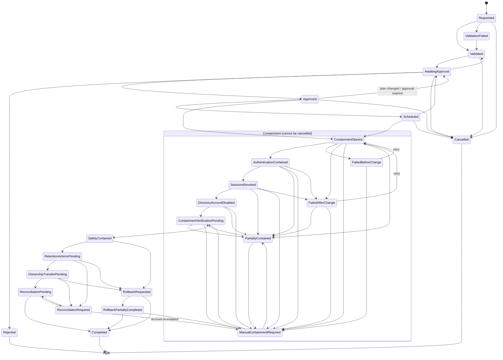
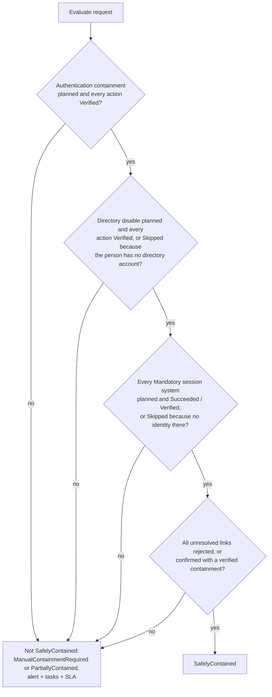
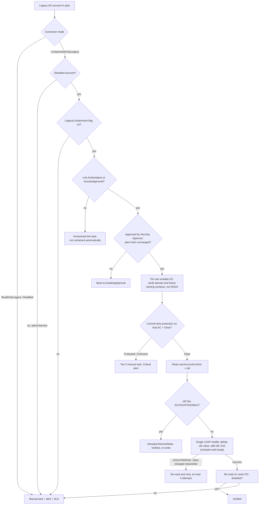

# Leaver workflow

A leaver is **SafelyContained** only when every mandatory control has been **verified**: observed, not merely attempted. Until then the request stays visible in a durable state, with alerts, manual tasks and SLA timers. A request can't silently disappear, and once containment starts it can't be cancelled.

Code:

- `Ilm.Modules.Leaver` (`LeaverWorkflowService`, `ContainmentPlanner`, `ContainmentExecutor`, `NonUrgentStageService`, `LeaverMaintenanceService`)
- `Ilm.Domain/Leaver` (`LeaverStateMachine`, `SafelyContainedPolicy`, `SafelyContainedEvaluator`)

The design reasoning is in [`docs/leaver-containment.md`](docs/leaver-containment.md).

## Steps

1. **Request** (Lifecycle Operator). The request names the person, reason, ticket reference (`^[A-Za-z0-9][A-Za-z0-9-]{2,39}$`), urgency (Urgent or Planned with an effective time) and an idempotency key. Scope is checked by resolving each account's OU GUID to a DN at request time.
2. **Validate and plan.** `ContainmentPlanner` gives every linked account an explicit method: `OktaApi`, `ContainmentOnlyLegacy`, `DirectActiveDirectory`, `VerifyOnly`, `SessionConnector` or `ManualControlled`. The reason for each decision is recorded, including authority, protection, connector mode and feature flags. The plan is hashed with SHA-256.
3. **Approve** (a different person). A Lifecycle Approver, or a Security Approver when the plan includes legacy containment or any Tier 0 or Unknown object. The approval binds to the plan hash and expires after `LeaverApprovalValidityHours` (24 by default).
4. **Execute** (Lifecycle Operator with freshly resolved roles, or the worker for scheduled requests). ILM rebuilds the plan and compares hashes, and if they differ it invalidates the approval and asks again. It then takes a per-person distributed lock and runs the steps in the mandated order:
   1. contain the authoritative authentication system
   2. revoke sessions
   3. disable the authoritative directory account
   4. verify

   A failure in one step never stops the later access-removing steps.
5. **Verify.** Okta status is read back. AD `userAccountControl` is read on the same DC that took the write. Session results come from the connectors.
6. **SafelyContained** (see the decision below). After that come the non-urgent stages, reconciliation and **Completed**.

## Leaver state machine

The allowed transitions are exactly `LeaverStateMachine.Allowed`, and unit tests pin them. Every exception state that needs attention (`ValidationFailed`, `ManualContainmentRequired`, `PartiallyContained`, `FailedBeforeChange`, `FailedAfterChange`, `ReconciliationRequired`, `RollbackPartiallyCompleted`) raises an alert.

### What each transition records

`LeaverTransition` is append-only: the database role has no UPDATE or DELETE, and a trigger blocks both. Each row has:

- `Ordinal`, operation ID, correlation ID and idempotency key
- actor and approver
- timestamp, reason and ticket reference
- previous and next state
- authority decision, protection decision and configuration version
- actions attempted, verified and unresolved
- safe error category

The same data goes into the audit chain as a `LeaverStateChanged` event.

## SafelyContained decision

The default policy (`SafelyContainedPolicy`):

| Control | Requirement |
|---|---|
| Authentication containment verified | Mandatory. The validator rejects weakening it (`SAFELY_CONTAINED_WEAKENED`). |
| Directory disable verified | Mandatory, and can't be weakened |
| Okta sessions | Mandatory |
| Entra sessions and tokens | Mandatory |
| Citrix sessions | Mandatory |
| VPN sessions | Best effort |
| Application sessions | Best effort |
| All identity links resolved | Required |
| Okta action | Deactivate (suspend is configurable). OAuth tokens are revoked. |
| Emergency AD override for Okta-owned accounts | Off |

"Succeeded" from a session connector means the provider accepted the revocation. ILM doesn't claim it closed sessions that downstream applications keep independently. A `NotConfigured` or `Unsupported` result on a mandatory session system becomes a manual task. That task is satisfied only by the operator recording evidence, because ILM can't observe the effect itself.

## The legacy containment exception

A person may still be working from a legacy forest with no target account. ILM must not block the leaver for that reason, and it must not make the legacy forest writable either. The `ContainmentOnlyLegacy` connector mode allows exactly one write.

What the mode never allows: create, enable, password reset, attribute changes (except a separately approved containment marker), group changes, OU moves, and deletion. `ConnectorModePolicy` is the single source of truth, and `GuardedDirectoryWriter` enforces it again at commit time. It needs no target identity.

## Scenario coverage

Each of these runs against the real services and database with mock directories and a mock Okta (`LeaverScenarioTests`):

| Scenario | Development person | Outcome |
|---|---|---|
| Okta-authoritative user | Alex Example | Okta deactivated, sessions revoked, AD verified with **no AD write**, SafelyContained |
| Legacy-AD-authoritative user, no target identity | Casey Placeholder | Legacy disable bit set and verified, SafelyContained |
| Target-AD-authoritative user | Dana Fictional | Direct AD containment is disabled by flag, so a manual task |
| Unresolved authority | Jordan Unmapped | ManualContainmentRequired, runbook, alert |
| Two identities during coexistence | Bailey Sample | Okta, target and legacy accounts all contained |
| Already-disabled account | (test setup) | Verified with no write |
| Protected account | Kai Privileged, Lee Nested | Tier 0 manual task, Critical alert |
| Protection unknown | Morgan Unknown | Tier 0 manual task |
| Provisional link | Harper Synthetic | Blocks SafelyContained until rejected, or approved and verified |
| Session revocation failure, AD disable failure, partial containment, outage before change | (fault injection) | PartiallyContained, FailedBeforeChange or manual, never silent |
| Repeated idempotency key, concurrent requests | | One request. A conflicting payload is refused. |
| Expired approval, plan changed after approval | | Back to AwaitingApproval, and the old approval is invalidated |

## Non-urgent stages

After SafelyContained, `NonUrgentStageService` creates tasks for:

- the AD group-removal plan, which preserves legal-hold, investigation and migration groups and the primary group
- mailbox ownership
- licence review, following the retention policy
- Mimecast and Citrix reconciliation
- data, device and application ownership

Their connectors are disabled, so each one is a manual task. ILM **never automatically**:

- deletes an account
- clears all groups
- clears `mail` or `proxyAddresses`
- changes `sourceAnchor` or immutable links
- removes SIDHistory
- deletes mailbox data
- removes licences outside the approved retention policy

The validator rejects `AutomaticDeletion`.

## Rollback

Re-enabling access is a grant. A Lifecycle Operator can request a rollback with `RequestRollbackAsync`, but a Security Approver must approve it, and the re-enable itself is a manual task. ILM never re-enables an account automatically.
