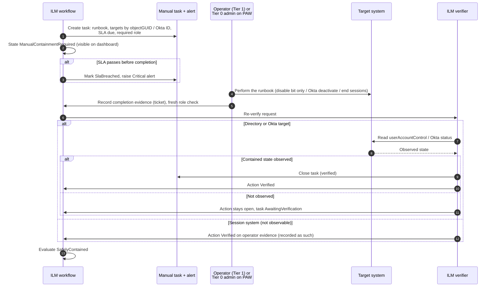

# Manual containment

When ILM can't safely automate a containment step, it doesn't stop and it doesn't hide the request. The step becomes a **manual controlled action**, which comes with:

- an exact runbook
- the target's stable identifiers
- an alert
- an SLA timer
- a required role

ILM then verifies the result wherever it can observe it. `ManualControlledStrategy` is always enabled. It's the failure direction for every access-removing action.

Code: `ContainmentExecutor.RequireManualAsync` and `EscalateToManualAsync`, `RunbookGenerator.ManualContainment`, `ManualTaskService`, `LeaverMaintenanceService`.

## When containment becomes manual

| Cause | Task kind | Severity | Recorded by |
|---|---|---|---|
| Object is Protected, or protection is Unknown | `Tier0Containment` | Critical | Security Approver. The work itself is done by a Tier 0 administrator on a PAW. |
| Authority missing or conflicting | `ManualContainment` | High | Lifecycle Operator |
| Connector mode forbids the write (`ReadOnlyLegacy`, `ReadOnlyTarget`, `Disabled`) | `ManualContainment` | High | Lifecycle Operator |
| Feature flag off (for example `DirectActiveDirectoryContainment`) | `ManualContainment` | High | Lifecycle Operator |
| Non-standard account on a containment-only legacy forest | `ManualContainment` | High | Lifecycle Operator |
| Automated attempt failed 3 times, or changed state but didn't verify | `ManualContainment` | High | Lifecycle Operator |
| Okta didn't disable the pushed AD account within `DirectoryVerificationTimeoutSeconds` | `ManualContainment` | High | Lifecycle Operator |
| Session connector returned `NotConfigured`, `Unsupported`, `Failed`, `ManualActionRequired` or `Unknown` | `SessionRevocation` | High for mandatory systems, Medium for best effort | Lifecycle Operator or Security Approver |
| Link confirmed after approval | `ManualContainment` | High | Lifecycle Operator |
| Identity link Provisional, Ambiguous or missing | `IdentityLinkConfirmation` | High | Lifecycle Approver |

## Manual fallback

**Recording a task doesn't mean the account is contained.** For AD and Okta targets, the task closes only when ILM reads the contained state back. For session systems ILM has no read path, so the operator's evidence is accepted and recorded as operator-attested in the audit.

## The runbook

Each task body is generated from the plan. It contains:

- the operation ID, the reason the step is manual, who must perform it, and when the SLA is due
- a Tier 0 banner for protected targets
- a targets table: system, connector or tenant, stable ID (objectGUID or Okta user ID), SID, last-known DN, and label
- the steps:
  1. locate each target by stable ID, never by name or DN
  2. set only the ACCOUNTDISABLE bit
  3. apply the approved Okta action and clear sessions
  4. end Entra, Citrix and VPN sessions
  5. record the change ticket
- a "Do not" list:
  - don't delete accounts
  - don't clear `mail` or `proxyAddresses`
  - don't change `sourceAnchor`
  - don't remove SIDHistory or licences
  - don't mark the task complete before the change is made

## SLAs

| Setting | Default | Where |
|---|---|---|
| `UrgentContainmentSlaMinutes` | 15 | `LifecyclePolicies.SafelyContained` |
| `ManualContainmentSlaMinutes` | 30 | Same |
| Identity link confirmation | 4 hours | `LeaverWorkflowService` |
| Worker cadence | 30 s | `Ilm:Workers:LeaverIntervalSeconds` |

`LeaverMaintenanceService` runs on the worker. It:

- expires stale approvals
- starts scheduled containment
- re-verifies in-flight requests
- marks breached tasks and raises a Critical `ManualTaskSlaBreached` alert

The dashboard shows unresolved manual containment and active alerts to every lifecycle role.

## When ILM itself is unavailable

If ILM is down, use the same runbook format by hand:

1. Identify every account for the person: Okta, target AD and each legacy AD. Use the People view from a read replica or the last export, or the directories directly.
2. Deactivate the Okta user and clear sessions in the Okta admin console.
3. Set the disable bit on each AD account (`Disable-ADAccount -Identity <objectGUID>`), from a PAW for any protected account.
4. End Entra, Citrix and VPN sessions.
5. When ILM returns, raise the leaver in ILM with the ticket reference. ILM verifies the already-disabled accounts without writing (`AlreadyInDesiredState`) and records the history.

See [DISASTER-RECOVERY.md](DISASTER-RECOVERY.md).
