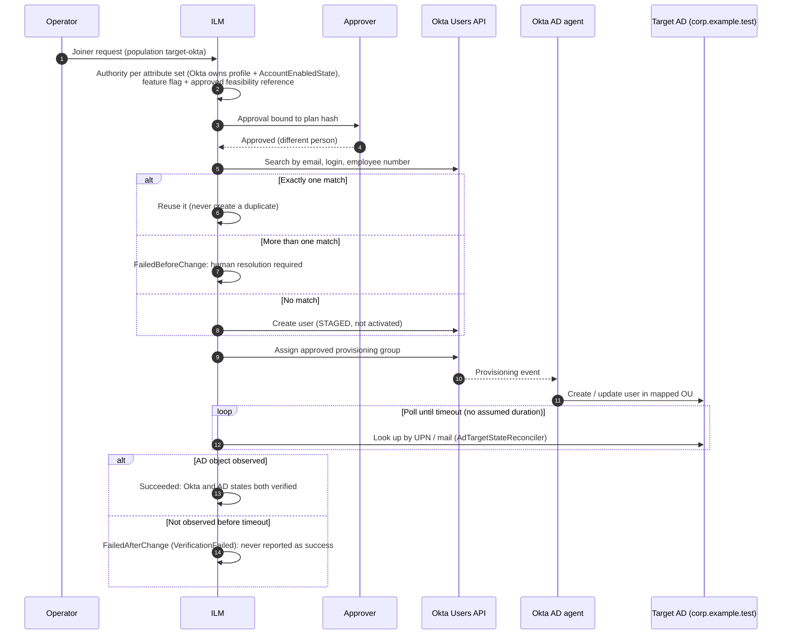

# Okta-to-AD provisioning

`OktaApiProvisioningStrategy` would create Okta-mastered users through the Okta Users API and let the Okta AD agent push them into AD. It's **disabled**. It can't be enabled until:

1. a PCATEST feasibility run has been approved by a Security Approver with a Go or Conditional Go recommendation, and
2. a dual-controlled configuration version references that approved run (run ID and report SHA-256) and turns on `OktaUserProvisioning` or `OktaToAdProvisioning`.

The validator rejects the flag without such a reference (`OKTA_PROVISIONING_WITHOUT_FEASIBILITY`). `ConfigurationService` also checks that the referenced run exists, is approved, and has a matching hash (`FEASIBILITY_REFERENCE_INVALID`).

Code:

- `Ilm.Application/Provisioning/OktaApiProvisioningStrategy.cs`
- `Ilm.Application/Okta/*` (ports)
- `Ilm.Infrastructure/Okta/Http/OktaApiClient.cs`
- `Ilm.Application/Feasibility/*` (harness and report)
- `Ilm.Infrastructure/Directory/AdTargetStateReconciler.cs`

## Provisioning flow (once enabled)



ILM reports success only after it has observed both the Okta state and the AD state. It never assumes that creating an Okta user creates an AD user ([ASSUMPTIONS.md](ASSUMPTIONS.md) A16).

## Ports

| Interface | Operations |
|---|---|
| `IOktaUserClient` | Create (staged or active), search by email, login and employee number, get, update profile, list factor types, list assigned apps |
| `IOktaLifecycleClient` | Activate, suspend, unsuspend, deactivate, read lifecycle state |
| `IOktaSessionClient` | Revoke user sessions, and optionally OAuth tokens |
| `IOktaGroupClient` | Assign to group, remove from group, list user group IDs |
| `IOktaApplicationClient` | Assign to app, read assignment roles (used for role resolution) |
| `IOktaSystemLogClient` | Query events since a time, filtered by user and event-type prefix |
| `IOktaFeasibilityCleanup` | Delete a synthetic user. It refuses any login without the required prefix. |
| `IAdTargetStateReconciler` | Find the pushed AD user by sAMAccountName, UPN, mail or objectGUID, and report its OU, attributes and enabled state |

`OktaApiClient` implements all of these over HTTPS. It uses `PrivateKeyJwtTokenProvider` for OAuth 2.0 client credentials with `private_key_jwt`:

- The service app's private key is a **non-exportable** certificate in `LocalMachine\My`, selected by thumbprint.
- There is **no SSWS token** and no client secret, and the configuration has no field for either.
- Responses are mapped to safe error categories. Rate limiting (HTTP 429) maps to the retryable `Timeout` category.
- Unit tests cover request shaping and error mapping with a stub HTTP handler. The client has not been run against a real Okta org.

### Okta service app (PCATEST first)

1. Create an **API Services** app with public key / private key authentication. Upload the public key of a certificate generated in the ILM host's machine store (non-exportable).
2. Grant only these scopes:
   - `okta.users.read` and `okta.users.manage`
   - `okta.groups.read` and `okta.groups.manage`
   - `okta.apps.read`
   - `okta.logs.read`
3. Assign a **custom admin role** limited to a resource set containing only the ILM-managed groups and the AD push assignment. Don't use Super Admin or Org Admin.
4. Set `Ilm:Okta:Mode=Live`, `OrgUrl`, `ServiceClientId`, `SigningCertificateThumbprint` and `SigningKeyId`.

## Feasibility harness

The 26 checks from the brief are implemented in `OktaAdFeasibilityHarness`:

1. create a staged user
2. assign the user to the group or application that drives AD provisioning
3. verify whether an AD object is created
4. record the provisioning delay
5. verify target OU selection
6. verify `sAMAccountName`
7. verify UPN
8. verify mail and proxy addresses
9. verify department
10. verify manager
11. verify account enabled state
12. verify initial password behaviour
13. verify group memberships
14. verify duplicate-user behaviour
15. verify existing-AD-user matching
16. verify suspension behaviour
17. verify deactivation behaviour
18. verify whether deactivation disables AD
19. verify whether reactivation re-enables AD
20. verify whether an ILM AD change is overwritten by the next push
21. verify Okta API and System Log correlation
22. verify failure when the Okta AD agent is unavailable
23. verify retry and duplicate prevention
24. verify that an existing Okta user is linked rather than duplicated
25. verify that factors and app assignments remain intact
26. verify rollback and clean-up of synthetic users

Each check returns `Passed`, `Failed`, `Observed`, `Skipped` or `Inconclusive`, with an observation. Rules for every run:

- The provisioning delay is measured by polling and never hardcoded.
- The harness uses only synthetic users with the configured login prefix, and deletes them at the end.
- AD objects are never deleted by ILM. They're listed for the lab clean-up procedure.

### Recommendation

`FeasibilityReportGenerator.Recommend`:

| Result | Recommendation |
|---|---|
| Mock run | **No-Go**, always |
| Any core check not `Passed`. The core checks are #1 staged create, #2 assignment, #3 AD object created, #14 duplicate user, #17 deactivation, #21 System Log correlation, #23 retry without duplicates, and #24 link rather than duplicate. | **No-Go** |
| Any other check `Failed`, `Skipped` or `Inconclusive`, or any condition found (for example, the push overwrites ILM changes, reactivation re-enables AD, or an agent outage leaves requests pending) | **Conditional Go**, with the conditions listed |
| Every check passed and no conditions | **Go** |

A mock run can't be submitted for approval. A PCATEST run refuses to start while the simulated Okta org is registered, or when the target connector isn't a live LDAP connector.

### Running it in PCATEST (not run in this repository)

1. Configure `Ilm:Okta` for the PCATEST org (Live mode, service app as above), and a `Ldap` connector for the PCATEST AD in the active configuration.
2. Write an options file:

   ```json
   {
     "environment": "PCATEST",
     "oktaOrg": "https://pcatest.okta.example.test",
     "adIntegration": "Okta AD agent PCATEST-AGENT01 → corp.example.test",
     "assignmentMechanism": "Group",
     "assignmentId": "00g0000000000000000",
     "targetConnectorId": "corp",
     "expectedOuDistinguishedName": "OU=Staff,OU=ILM Managed,DC=corp,DC=example,DC=test",
     "syntheticLoginPrefix": "ilmfeas-",
     "syntheticEmailDomain": "example.test",
     "operatorConfirmedAgentOutageWindow": false,
     "sourceProfileSettings": "<copied from the Okta AD integration>",
     "pushMappings": "<copied from the Okta AD integration>",
     "passwordBehaviourNotes": "<observed>",
     "licensingNotes": "<observed>"
   }
   ```

3. Run `dotnet Ilm.Web.dll feasibility --mode pcatest --options pcatest.json --output OKTA-AD-FEASIBILITY-REPORT.md`.
4. A Configuration Administrator submits the run for approval (Admin → Feasibility), and a Security Approver approves or rejects it.
5. Clean up the AD objects the report lists, using the lab procedure in [ACTIVE-DIRECTORY.md](ACTIVE-DIRECTORY.md).

The current [OKTA-AD-FEASIBILITY-REPORT.md](OKTA-AD-FEASIBILITY-REPORT.md) comes from a **mock** run. It shows the format and says so on its first line. It's **not evidence**, and its recommendation is No-Go.
