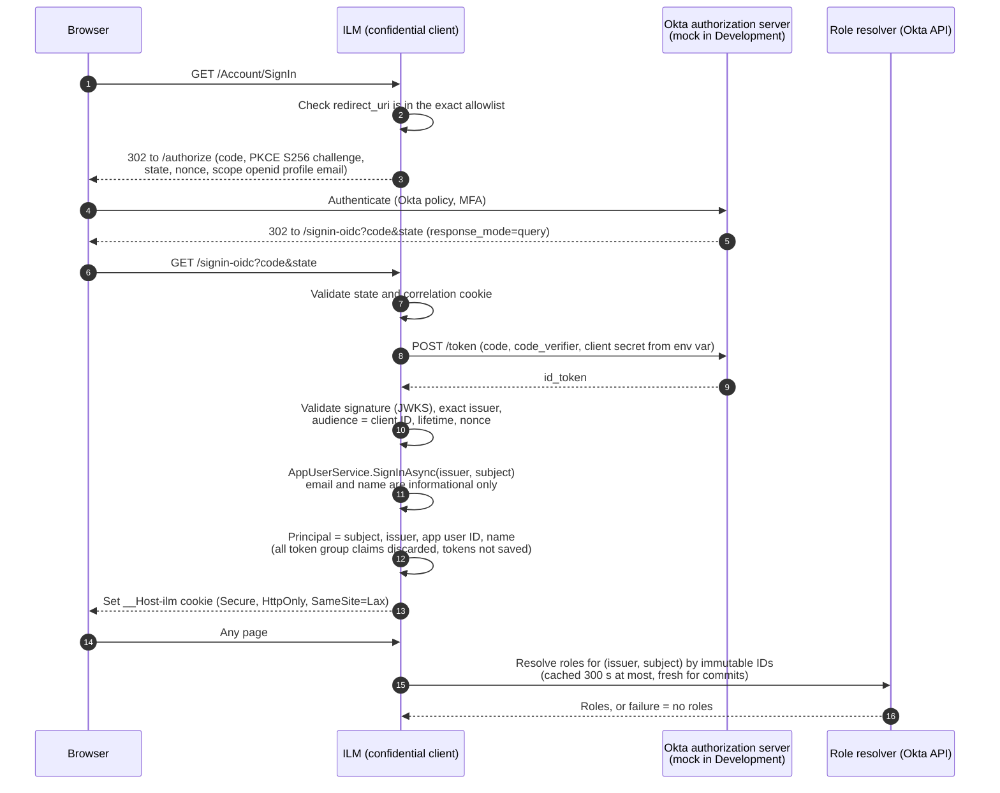

# Okta OIDC sign-in

Operators sign in only through Okta OpenID Connect. ILM has no password form and never sees an operator's AD password. In Development and Testing, an in-process mock OIDC provider stands in for Okta. Startup refuses to register the mock in any other environment.

Code: `Ilm.Web/Authentication` (`OidcSetup`, `IlmClaimsTransformation`, `CurrentActorAccessor`, `MockOidcProvider`, `MockOidcEndpoints`), `Ilm.Application/Security` (`AppUserService`, `IssuerMigrationService`), `Ilm.Infrastructure/Security/OktaPrivilegedRoleResolver.cs`.

## Authentication flow

## Settings

| Setting | Value |
|---|---|
| Flow | Authorization code with PKCE (S256), confidential client |
| Response mode | `query` |
| Scopes | `openid profile email` |
| Issuer | Exact string match (`Ilm:Authentication:Issuer`), checked by the token handler and again in `OnTokenValidated` |
| Audience | `Ilm:Authentication:ClientId` |
| Client secret | Read from the environment variable named in `ClientSecretEnvironmentVariable`. The secret itself is never in configuration. |
| Redirect URI | `PublicBaseUrl` + `/signin-oidc`, which must appear **exactly** in `AllowedRedirectUris`. It's checked at startup and on every redirect. |
| Cookie | `__Host-ilm`, `Secure`, `HttpOnly`, `SameSite=Lax`, sliding, `SessionMinutes` (30) |
| Tokens | `SaveTokens=false` and `MapInboundClaims=false` |
| Metadata | HTTPS required |

## Identity key

An application user is keyed by **(issuer, subject)**, never by email, UPN, username, display name or group name. `AuthenticationTests` show that a changed email updates only the informational fields, and never creates a second user.

### Choosing the authorisation server

Before production, choose between the Okta **org** authorisation server (issuer `https://{org}.okta.com`) and a **custom** one (issuer `https://{org}.okta.com/oauth2/{id}`). The choice is open question V6 in [docs/open-questions.md](docs/open-questions.md). The two issue different `iss` values, and a subject is only unique within its issuer.

**Changing the issuer is an identity migration, not a configuration edit.**

- A first sign-in under a new issuer, whose subject is still active under the old issuer, creates an application user in `PendingIssuerMigration`. That user holds **no roles**. `AppUserService.RoleBlockerAsync` gates both the cached and the fresh role resolution.
- `IssuerMigrationService` links the old and new pairs under dual control: proposed by one person, approved by a Security Approver (content-hash bound), then applied. Applying it activates the new identity and marks the old one `Migrated`.
- Separation-of-duties checks treat migrated identities as the **same person**. Someone who raised a request under the old issuer can't approve it under the new one. (Tested in `Issuer_change_is_an_identity_migration_requiring_security_approval`.)
- If the new issuer is in a **different Okta org**, subjects change too, and ILM can't correlate the identities automatically. Complete or cancel every pending approval before the switch, then propose a migration for each operator.

## Roles

Group claims in the token are ignored, because Okta group names can be changed by anyone who can administer the group. `IlmClaimsTransformation` asks `IPrivilegedRoleResolver`, which checks one of these on the server:

- **`OktaGroupMembership`**: the user's groups by immutable group ID (`00g…`), mapped to roles in the approved configuration.
- **`OktaAppAssignment`**: the role values on the user's ILM app assignment.

Resolution is cached for at most 300 s (`ROLE_CACHE` validator). The cache is bypassed (`RolesFreshlyResolved`) for:

- approving
- executing containment
- recording manual tasks
- activating configuration

If resolution fails, the user gets **no roles**. The development data includes Mallory, whose unmapped group has been renamed to `ILM-SecurityApprovers`. The tests show she gets no role.

## Development mock

- The mock is enabled when `Ilm:Authentication:Mode=MockOidc` and the environment is Development or Testing.
- It lives at `https://localhost:5001/mock-oidc`, with discovery, JWKS, authorize (a user picker listing the fictional operators) and token endpoints.
- It enforces PKCE S256, the exact redirect URI, and the client ID. It generates a random client secret and RSA signing key at startup and keeps both only in memory.
- Its token endpoint is reached through an in-process backchannel handler. The real OIDC handler still performs full validation.

Fictional operators:

| Operator | Role |
|---|---|
| Olivia Operator | Lifecycle Operator |
| Adrian Approver | Lifecycle Approver |
| Sasha Security | Security Approver |
| Casey Config | Configuration Administrator |
| Audrey Auditor | Auditor |
| Dale DBA | None |
| Mallory Renamed | None (decoy) |

## Okta production setup (unverified here)

1. Create an OIDC **Web** app integration:
   - grant type Authorization Code
   - sign-in redirect `https://ilm.corp.example.test/signin-oidc`
   - sign-out redirect `https://ilm.corp.example.test/signout-callback-oidc`
   - client authentication Client secret (or `private_key_jwt`)
   - PKCE required
2. Assign only the ILM role groups. Record each group's **ID** in the configuration `RoleMappings`.
3. Store the client secret in the vault, and inject it as `ILM_OIDC_CLIENT_SECRET` into the app pool environment.
4. Apply an authentication policy that requires phishing-resistant MFA for the app.
5. Restrict who can administer the ILM role groups to Tier 1 Okta administrators, and monitor `group.user_membership.add` for those groups in the System Log (THREAT-MODEL R3).
