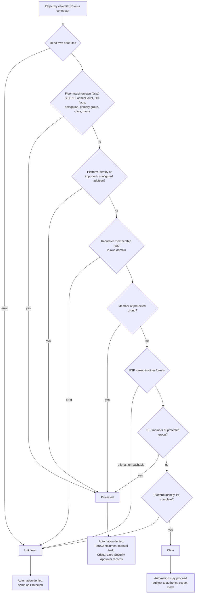

# Protected objects

ILM is Tier 1. It never automates an action on a Tier 0 or Tier 0-adjacent object, and **no administrator, approval or configuration can override that.** When ILM finds a protected object in a leaver plan, it produces a Tier 0 manual task for a Tier 0 administrator working on a PAW.

Code:

- `Ilm.Domain/Protection/ProtectionFloor.cs` (hardcoded)
- `ProtectionEvaluator.cs` (combines sources)
- `Ilm.Application/Protection/ProtectionService.cs` (gathers facts from the directory)
- `GuardedDirectoryWriter` (re-checks at commit time)

## Sources of protection

| Source | Can it be removed? | Contents |
|---|---|---|
| **Hardcoded floor** | No. It's code, and changing it is a code change with review. | See below |
| **Platform identities** (`Ilm:Platform`) | No. They're configured at deployment, and the validator rejects any managed-list reference to them. | The ILM runtime gMSA, the ILM host computer accounts, the database service identity, break-glass accounts, and principals allowed to retrieve the gMSA password |
| **Imported attack-path lists** | Only by a new approved import. Additions only. | Output of the periodic attack-path analysis (DCSync-equivalent rights, AdminSDHolder and domain-root controllers, privileged GPO editors, CA, ADFS, Okta agent and Entra sync servers, Citrix infrastructure) |
| **Configured additions** | Only through dual-controlled configuration. Additions only. | Anything else the Security Approver marks as protected |

ILM doesn't try to calculate every ACL-based path to Tier 0 itself. That's the job of the imported list.

### The hardcoded floor

- **Domain RIDs.** These are protected in every domain:

  | RID | Group or account |
  |---|---|
  | 498 | Enterprise Read-only Domain Controllers |
  | 500 | Administrator |
  | 502 | krbtgt |
  | 512 | Domain Admins |
  | 516 | Domain Controllers |
  | 517 | Cert Publishers |
  | 518 | Schema Admins |
  | 519 | Enterprise Admins |
  | 520 | Group Policy Creator Owners |
  | 521 | Read-only Domain Controllers |
  | 526 | Key Admins |
  | 527 | Enterprise Key Admins |

- **Builtin SIDs.** These are protected everywhere:

  | SID | Group |
  |---|---|
  | S-1-5-32-544 | Administrators |
  | S-1-5-32-548 | Account Operators |
  | S-1-5-32-549 | Server Operators |
  | S-1-5-32-550 | Print Operators |
  | S-1-5-32-551 | Backup Operators |
  | S-1-5-32-552 | Replicator |

- **Object facts:**
  - `adminCount=1`
  - the DC and RODC `userAccountControl` flags
  - unconstrained delegation (`TRUSTED_FOR_DELEGATION`)
  - a primary group of Domain Controllers, RODCs, or any protected RID
  - managed service account classes (gMSA, sMSA, dMSA)
  - `sAMAccountName` prefixes `MSOL_`, `AAD_`, `Sync_` and `krbtgt`
- **Membership.** Recursive membership of any protected group is checked with the `LDAP_MATCHING_RULE_IN_CHAIN` rule (`1.2.840.113556.1.4.1941`) against the object's own domain. Cross-forest membership is resolved through **foreign security principals**: the object's SID is looked up as an FSP in each other forest's `CN=ForeignSecurityPrincipals`, and the FSP's in-chain memberships are checked.

## Evaluation



**Protected always wins, and Unknown means deny.** A connector outage, an unreadable membership, or missing platform identity configuration all produce Unknown. Unknown is never treated as Clear. `ProtectionService` evaluates when the plan is built, and `GuardedDirectoryWriter` evaluates again just before the write, on the same DC.

## What configuration can't do

The `ConfigurationValidator` rejects any configuration that:

- references a floor SID or RID, or a platform identity, in a list of managed objects (`PROTECTION_SOURCE`)
- assigns a protected group through a template or group plan (`PROTECTED_GROUP_ASSIGNMENT`)
- makes the runtime identity manageable (`RUNTIME_IDENTITY_MANAGEABLE`)
- enables an unknown feature such as "ManageTier0" (`FEATURE_UNKNOWN`)

The schema has no field to exclude, exempt or remove protection.

## Importing an attack-path list

Admin → Protection → Import (Configuration Administrator). The format is one `matchOn,value,category` entry per line, and lines starting with `#` are comments:

```
# BloodHound export 2026-09, reviewed by SEC-1234
Sid,S-1-5-21-1000000001-1000000002-1000000003-1105,DcSyncRights
DnsHostName,adfs01.corp.example.test,AdfsServer
ObjectGuid,6f1c0a9e-0000-4000-8000-000000000001,PrivilegedGpoEditor
```

`matchOn` is `Sid`, `ObjectGuid`, `DnsHostName` or `SamAccountName`. `category` is a `ProtectionCategory`. The import becomes a configuration proposal with source `ImportedAttackPath` and the analysis reference, and a Security Approver must approve it (see [APPROVALS.md](APPROVALS.md)).

## Tests

These tests are in `ProtectionFloorTests` and `ProtectionAndViewsTests`, and pass against the mocks:

- a hardcoded SID can't be removed
- an `adminCount` object is denied
- recursive protected membership is denied
- a foreign security principal is handled
- the runtime identity is denied
- the gMSA retrieval principal is protected
- a protected server is denied
- an attack-path import adds protection
- an unknown protection state is denied
