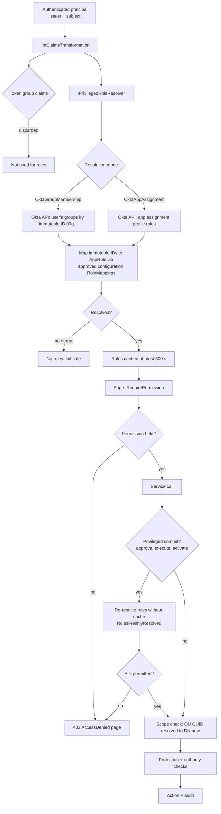

# Security

ILM is a Tier 1 system that can disable accounts. This page lists the security controls and where each one lives in the code. Threats and residual risks are in [THREAT-MODEL.md](THREAT-MODEL.md).

## Non-negotiable rules

| Rule | How it's enforced |
|---|---|
| ILM never manages Tier 0 | Hardcoded `ProtectionFloor` in code, checked again in `GuardedDirectoryWriter` at commit time. No feature flag exists. The configuration schema has no field for exclusions. See [PROTECTED-OBJECTS.md](PROTECTED-OBJECTS.md). |
| No stored directory password | The runtime identity is a gMSA. `LdapConnectionFactory` binds with Negotiate and a null credential. In every environment, `StartupValidator` refuses to start if a configuration key named like a password, secret, token or credential holds a value. In production it also refuses a connection string that contains a password. |
| No AD password form | No page accepts a password. Operators authenticate only through Okta OIDC. `SecurityTests` scan every Razor page for `type="password"`. |
| No Okta token in source or configuration | The service app uses `private_key_jwt` with a non-exportable certificate in the machine store. `OktaOptions` has no token or secret field. |
| No secrets in audit or logs | `AuditSanitizer` redacts password, secret, token, key and authorisation values, including nested ones and bearer or SSWS strings. Tests check the audit table and the database file for a planted value. |
| No Domain Admin | Delegation grants only read access, plus `userAccountControl` write on legacy containment OUs. See [ACTIVE-DIRECTORY.md](ACTIVE-DIRECTORY.md). |
| Tier 0 can't be enabled through configuration | Unknown feature names are rejected (`FEATURE_UNKNOWN`). Floor identifiers in managed lists are rejected (`PROTECTION_SOURCE`, `PROTECTED_GROUP_ASSIGNMENT`). |

## Authentication

See [OKTA-OIDC.md](OKTA-OIDC.md). In summary:

- authorisation code flow with PKCE, a confidential client, and exact issuer and audience validation
- a `__Host-ilm` cookie that is `Secure`, `HttpOnly` and `SameSite=Lax`, with sliding expiry
- application users are keyed by `(issuer, subject)`

## Authorisation

| Role | Can | Can't |
|---|---|---|
| Reader | View directory and people | Request, approve or view audit |
| Lifecycle Operator | Request leavers, execute containment, record manual tasks, propose links | Approve anything |
| Lifecycle Approver | Approve leavers and links | Request or execute |
| Security Approver | Approve configuration, feasibility, legacy containment and Tier 0 manual tasks. Can satisfy a Lifecycle Approver requirement. | Propose configuration |
| Configuration Administrator | Propose and activate approved configuration, run feasibility | Approve their own proposal |
| Auditor | Read, verify and export audit | Any lifecycle action |
| Database Administrator | Nothing in the application | Everything in the application |

The full permission matrix is in `Ilm.Application/Security/Permissions.cs`.

## Separation of duties

- A requester can't approve their own request. `ApprovalService` checks the app user ID, not the name.
- A configuration proposer can't approve their own proposal.
- An identity link can't be approved by the person who proposed it.
- An approval binds to the SHA-256 hash of the plan or configuration content. Any change invalidates it (see [APPROVALS.md](APPROVALS.md)).

## Web hardening

`SecurityHeadersMiddleware` sets:

- CSP `default-src 'self'` with no inline scripts and `frame-ancestors 'none'`
- `X-Frame-Options: DENY`, `X-Content-Type-Options: nosniff` and `Referrer-Policy: no-referrer`
- HSTS outside Development

Antiforgery and TempData cookies use the `__Host-` prefix. Every form posts through the tag helpers so it carries the antiforgery token. Errors shown to users are safe categories (`SafeErrorCategory`), never stack traces.

## Secrets

| Secret | Where it lives |
|---|---|
| OIDC client secret | Environment variable named by `Ilm:Authentication:ClientSecretEnvironmentVariable` (default `ILM_OIDC_CLIENT_SECRET`), injected from the vault into the app pool |
| Okta service-app key | Non-exportable certificate in `LocalMachine\My`, referenced by thumbprint |
| Audit HMAC key | `ILM_AUDIT_HMAC_KEY`, held outside the database. The development key is generated into `App_Data/audit-dev.key`, which is git-ignored. |
| SIEM token | `ILM_SIEM_TOKEN` |
| Database | Kerberos (the gMSA) through `pg_hba` `gss`, so there is no password in the connection string. See [DATABASE-SECURITY.md](DATABASE-SECURITY.md). |
| Development mock OIDC | Client secret and RSA key generated at startup and held only in memory |

Secret scanning with `detect-secrets` and the `SecurityTests` source scan are described in [TESTING.md](TESTING.md).

## Reporting a vulnerability

Report issues privately to the security architect (see the roles in [CHANGE-MANAGEMENT.md](CHANGE-MANAGEMENT.md)). Don't open a public issue.
