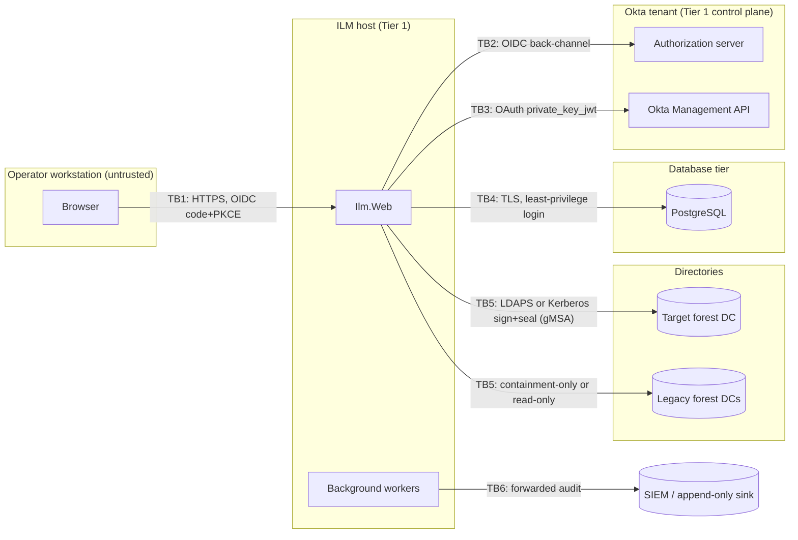

# Threat model

**Method:** STRIDE for each trust boundary, plus abuse cases specific to identity lifecycle tooling. Each mitigation names the code or document that implements it. Residual risks are listed at the end.

## 1. Assets

| Asset | Why it matters |
|---|---|
| Ability to disable accounts (containment) | Misuse denies service to legitimate users. Failure leaves leavers with access. |
| Ability to create, enable or modify accounts (disabled today) | This path grants access. If it reached Tier 0, it would compromise the domain. |
| ILM runtime identity (gMSA) and its delegated OU rights | Whoever can use it acts as ILM. |
| Okta service-app credentials | Can suspend, deactivate or create users in Okta. |
| Database: persons, identity links, topology, protected-object lists, audit | Personal data and a map of privileged objects. |
| Audit chain and forwarded copy | Evidence for investigations. Tampering hides misuse. |
| Active configuration (authority rules, connector modes, protection additions, flags) | One bad version could make a legacy forest writable, or remove added protection. |
| Operator sessions | Hijacking one gives that operator's roles. |

## 2. Actors

| Actor | Trust |
|---|---|
| Lifecycle Operator, Lifecycle Approver, Security Approver, Configuration Administrator, Auditor | Authenticated through Okta. Roles are resolved server-side from immutable IDs. |
| Database Administrator | Trusted with the platform, not with lifecycle actions. Treated as a potential insider for audit integrity. |
| Okta administrator | Can change who holds ILM roles. Treated as at least Tier 1. |
| AD administrator (Tier 0) | Outside ILM. Performs Tier 0 manual tasks on PAWs. |
| External attacker | No direct access. ILM isn't internet-facing. |
| Compromised workstation of an operator | Can ride an operator session. |

## 3. Data flow and trust boundaries

## 4. STRIDE per boundary

### TB1: browser to ILM

| Threat | Mitigation | Where |
|---|---|---|
| **S**poofing an operator | Okta OIDC authorization code flow with PKCE, a confidential client, exact issuer, audience and signature validation, state and nonce. No password form. | `Ilm.Web/Authentication/OidcSetup.cs` |
| Identity keyed by mutable attributes | Application users are keyed by `(issuer, subject)`. Email changes don't create a new user. An issuer change is an explicit, dual-controlled migration. | `AppUserService`, `IssuerMigrationService` |
| Session theft | `__Host-` cookie that is `Secure`, `HttpOnly` and `SameSite=Lax`, with a short sliding lifetime. Tokens aren't saved in the cookie. | `OidcSetup.cs` |
| **T**ampering with requests (CSRF) | Antiforgery on every POST. Approvals bind to the plan hash the approver saw. | Razor Pages default, `ApprovalService` |
| Clickjacking | `frame-ancestors 'none'`, `X-Frame-Options: DENY` | `SecurityHeadersMiddleware` |
| Script injection | CSP `default-src 'self'` with no inline script. Razor output encoding. | `SecurityHeadersMiddleware` |
| **R**epudiation | Every state change writes a chained, MAC'd audit record with the actor's issuer and subject. | `AuditWriter` |
| **I**nformation disclosure | Safe views allowlist attributes. Password, LAPS and gMSA-password attributes are never requested. Exports are neutralised against CSV formula injection. | `SafeAttributeAllowlist`, `CsvExporter` |
| **E**levation through mutable group names | Group claims in the token are discarded. Roles come from server-side resolution against immutable group IDs or app assignment. Privileged operations re-resolve roles without the cache. If resolution fails, the user gets no roles. | `IlmClaimsTransformation`, `OktaPrivilegedRoleResolver` |

### TB2 and TB3: ILM to Okta

| Threat | Mitigation |
|---|---|
| Stolen Okta API credential | OAuth service app with `private_key_jwt`. The key is in the machine certificate store, non-exportable. No SSWS token, and no token in configuration or source. |
| Over-privileged service app | Least-privilege scopes plus a custom admin role limited to the ILM-managed resource set (see [`OKTA-AD-PROVISIONING.md`](OKTA-AD-PROVISIONING.md)). |
| Okta outage during containment | Bounded retries, then ManualControlledStrategy with an alert and an SLA timer. The request stays visible and never disappears. |
| Okta admin grants ILM roles to an attacker | Role grants are an Okta change and appear in the Okta System Log. The documentation requires the Okta admin role for ILM groups to be Tier 1-controlled. Residual risk R3. |

### TB4: ILM to database

| Threat | Mitigation |
|---|---|
| Plaintext DB traffic | Production refuses to start unless the connection string requires TLS with full verification. | 
| App identity altering the schema or history | Separate roles: `ilm_migrator` owns the schema, while `ilm_app` has DML only, and on audit tables only INSERT and SELECT. A trigger blocks UPDATE, DELETE and TRUNCATE on the audit table. Tested against PostgreSQL. |
| **DBA rewrites audit history** | Each record is hash-chained and HMAC'd with a key held outside the database. Every sealed record, with its hash and MAC, is forwarded to an append-only sink, and the forwarding checkpoint records the last forwarded hash. The verifier detects breaks, re-hashes, bad MACs and divergence from the sink. A DBA can delete or alter rows, but not without detection. |
| DBA reads personal data | Encryption at rest protects the media, not a DBA session. PostgreSQL logs DBA access (`log_connections`, `pgaudit` recommended). The DBA role holds no ILM lifecycle role. Residual risk R4. |
| **Backups leak or are restored to roll back history** | Encrypted backups with keys held apart from the DBA team. Restore tests run the audit verifier and compare it with the SIEM copy. A rollback shows up as a missing tail relative to the sink. See [`DATABASE-SECURITY.md`](DATABASE-SECURITY.md). |

### TB5: ILM to directories

| Threat | Mitigation |
|---|---|
| Stored bind password | None exists. The gMSA is the process identity. Configuration has no password fields, and a startup validator rejects any. |
| Man-in-the-middle on LDAP | LDAPS with certificate chain and name validation, or Kerberos sign-and-seal. Simple binds are refused. |
| LDAP injection | Filters are built only through `LdapFilter` (RFC 4515 escaping). Objects are addressed by `<GUID=...>`. DNs from the UI are never used. |
| ILM acting on Tier 0 | Hardcoded floor (well-known SIDs and RIDs, DCs, gMSAs, unconstrained delegation, `adminCount=1`, platform identities), imported attack-path lists, and configured additions. If protection can't be evaluated, the result is Unknown, which means deny plus a manual task. No UI or configuration path can remove the floor. |
| Legacy forest misuse | Connector mode `ContainmentOnlyLegacy` allows only disable, verify and an approved marker, enforced by `ConnectorModePolicy` and `GuardedDirectoryWriter`. Code computes `new = old | ACCOUNTDISABLE`, and compare-and-swap prevents lost updates. |
| Stale reads across DCs | One writable DC per workflow, recorded on each action. Commit-time rechecks and verification run on the same DC. |
| Wrong person disabled | Only Authoritative or HumanApproved links are contained automatically. Provisional, ambiguous and email-only links need confirmation, and name-only evidence can never be approved. |

### TB6: audit forwarding

| Threat | Mitigation |
|---|---|
| Forwarder silently stops | Its checkpoint lag is exposed as a health check. Lag beyond `Ilm:Audit:MaxForwardingLag` makes the service Degraded, and the worker raises a High `AuditForwardingLag` alert. |
| Sink tampering | The sink is append-only and outside the DBA's control. Records carry their own hash and MAC. |

## 5. Abuse cases

| # | Abuse case | Control |
|---|---|---|
| AC1 | Operator requests and approves their own leaver to disable a rival | Self-approval is rejected, and the approval needs the approver role. The approval binds to the plan hash. |
| AC2 | Config admin makes a legacy connector writable | The validator rejects general-write modes on legacy forests. Every configuration version needs Security Approver approval from a different person. |
| AC3 | Config admin enables Okta provisioning early | The validator requires an approved feasibility report with a Go or Conditional Go recommendation. |
| AC4 | Anyone removes Domain Admins from protection | The floor is code, not configuration. The configuration schema has no exclusion field, and the validator rejects floor identifiers in managed lists. |
| AC5 | Attacker renames an Okta group to `ILM-SecurityApprovers` | Names are ignored. Only immutable group IDs map to roles. |
| AC6 | Leaver request silently fails | Every failure state creates an alert and a manual task with an SLA. Containment never fails closed into invisibility. |
| AC7 | Replay of a containment request | Idempotency keys are unique. A repeated key returns the existing operation, and a conflicting payload is rejected. |
| AC8 | Two operators contain the same person at once | One active leaver per person (a unique filtered index), plus a lease-based distributed lock during execution. |
| AC9 | Plan changes after approval (a new account appears) | The plan hash is recomputed before execution. A mismatch invalidates the approval. |
| AC10 | Break-glass or runtime identity managed through ILM | Platform identities are on the floor. The validator rejects configuration that references them in managed lists. |

## 6. Residual risks

| # | Risk | Owner |
|---|---|---|
| R1 | Real LDAP, gMSA and Okta behaviour are unverified until the Phase 3 lab and the Phase 4 PCATEST run | AD engineer, Okta engineer |
| R2 | Session connectors other than Okta are typed stubs (`NotConfigured`). Containment for those systems is manual until they're implemented. | Security architect |
| R3 | Okta administrators can grant ILM roles. This relies on Okta admin-role hygiene and System Log monitoring. | Okta engineer |
| R4 | A DBA can read personal data in the database | Data protection officer |
| R5 | An HMAC key compromise on the host lets an attacker forge a consistent chain. The off-box sink copy still detects it. | Security architect |
| R6 | Access tokens and Kerberos tickets already issued survive containment until they expire | Security architect |
